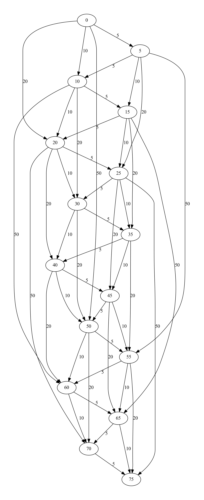

Vending machine state machine generator.

## Usage
Use the `save` command to just create a DOT-file and `render` to also render it.
**Note**: Rendering requires GraphViz' `dot.exe` in the system `PATH`.
```
vendingmachine.py save <TARGET> <INCREMENTS> [--initial=0] [--out=vending_machine.dot]
vendingmachine.py render <TARGET> <INCREMENTS> [--initial=0] [--out=vending_machine.dot] [--view=False]
```

## Example
Coffee machine that accepts 5, 10, 20 and 50 cents where a coffee costs 75 cents.
```
vendingmachine.py render 75 [5,10,20,50] --out 75cent-coffee.dot --view True
```

### Resulting DOT-file
```
digraph {
	0
	65
	5
	70
	10
	75
	15
	20
	25
	30
	35
	40
	45
	50
	55
	60
	30 -> 50 [label=20]
	20 -> 25 [label=5]
	40 -> 45 [label=5]
	25 -> 75 [label=50]
	0 -> 20 [label=20]
	15 -> 20 [label=5]
	35 -> 45 [label=10]
	55 -> 75 [label=20]
	35 -> 55 [label=20]
	10 -> 15 [label=5]
	65 -> 70 [label=5]
	0 -> 10 [label=10]
	50 -> 60 [label=10]
	40 -> 60 [label=20]
	65 -> 75 [label=10]
	60 -> 70 [label=10]
	10 -> 30 [label=20]
	25 -> 30 [label=5]
	15 -> 35 [label=20]
	20 -> 30 [label=10]
	0 -> 50 [label=50]
	35 -> 40 [label=5]
	5 -> 25 [label=20]
	50 -> 70 [label=20]
	20 -> 70 [label=50]
	55 -> 65 [label=10]
	20 -> 40 [label=20]
	25 -> 35 [label=10]
	45 -> 65 [label=20]
	15 -> 25 [label=10]
	70 -> 75 [label=5]
	15 -> 65 [label=50]
	25 -> 45 [label=20]
	5 -> 15 [label=10]
	0 -> 5 [label=5]
	50 -> 55 [label=5]
	45 -> 55 [label=10]
	5 -> 10 [label=5]
	30 -> 35 [label=5]
	55 -> 60 [label=5]
	30 -> 40 [label=10]
	45 -> 50 [label=5]
	60 -> 65 [label=5]
	10 -> 20 [label=10]
	40 -> 50 [label=10]
	5 -> 55 [label=50]
	10 -> 60 [label=50]
}
```

### Rendered result

